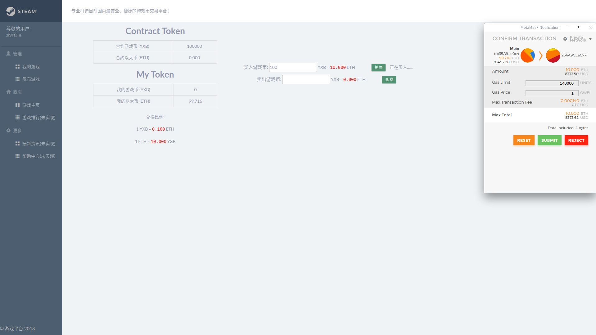
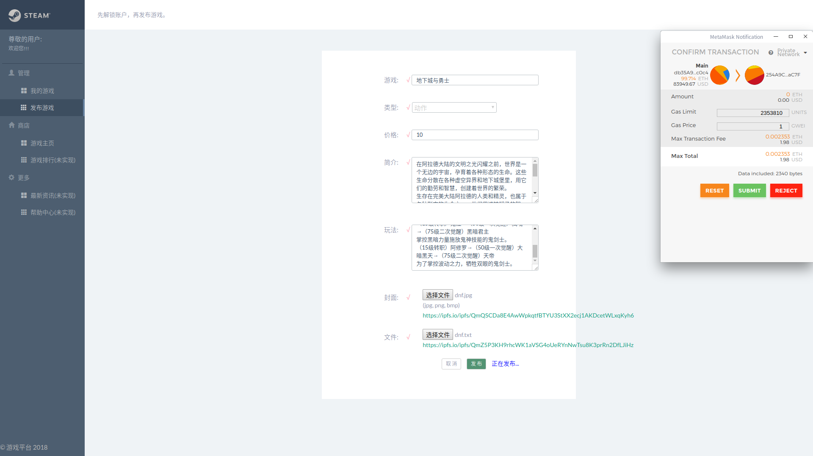
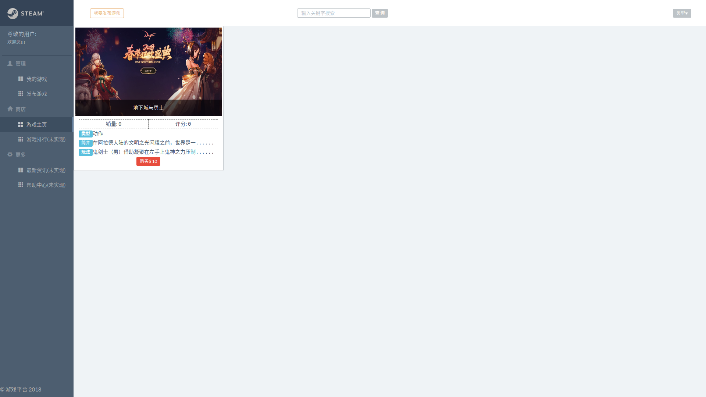
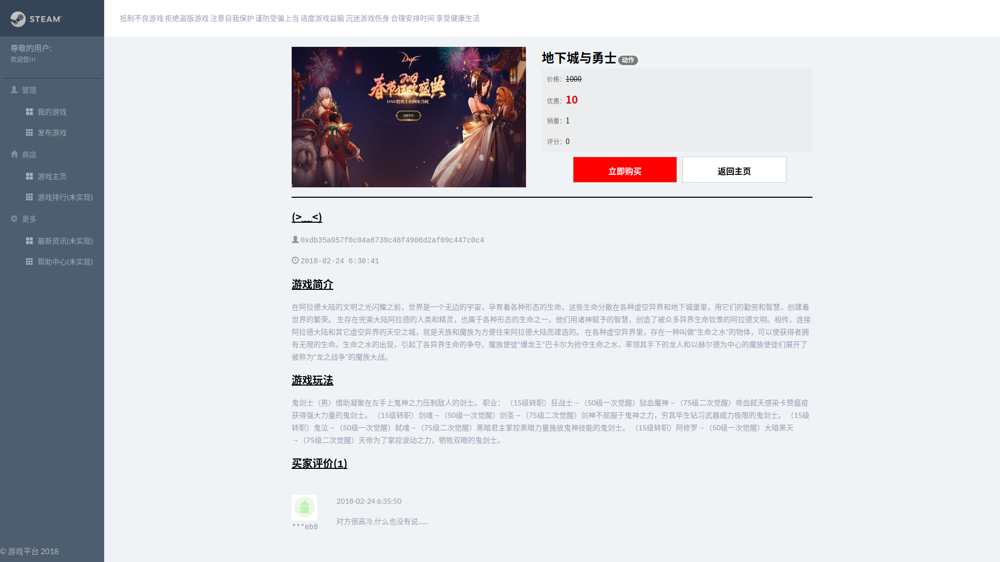
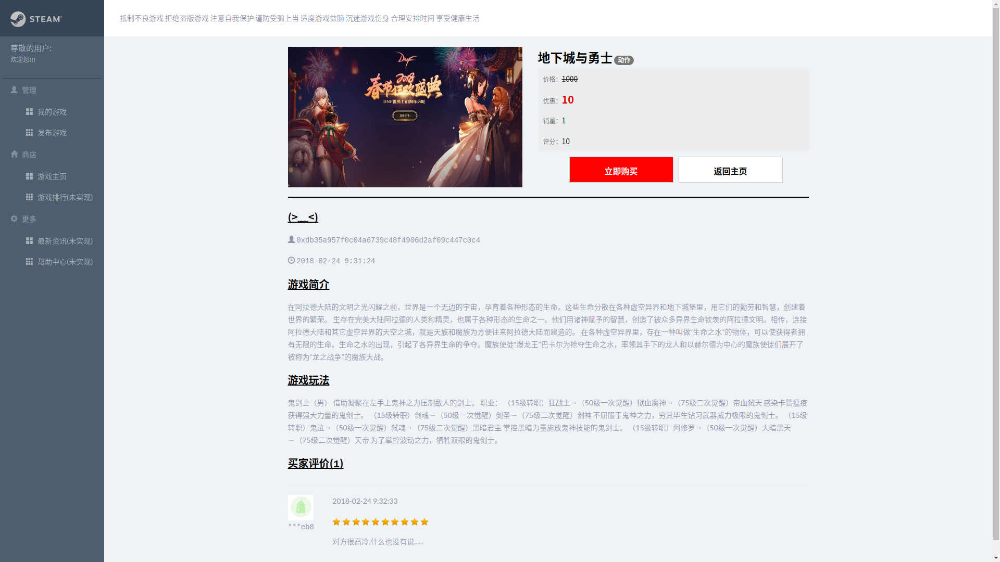
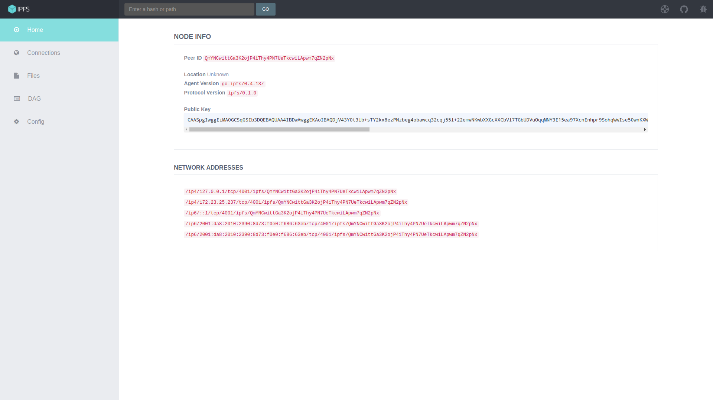
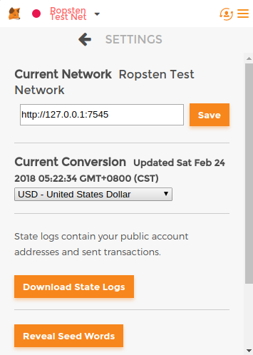
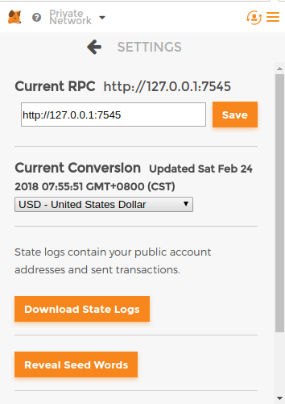
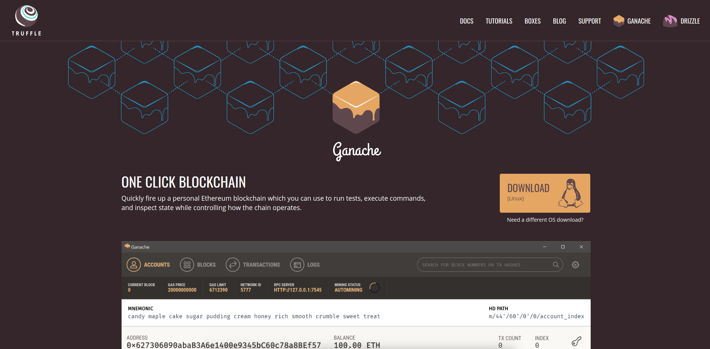
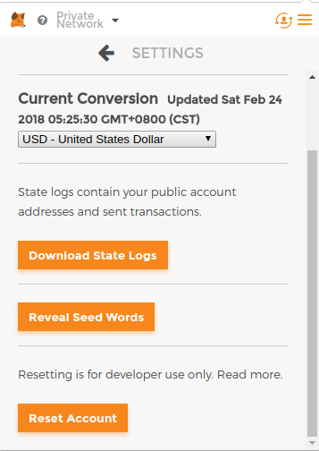

# 基于 Ethereum & IPFS 的去中心化游戏平台
游戏平台只是一个简单演示，方便迁移到其他项目。

## 项目展示
1. 发布游戏 账号一

2. 兑换代币 账号二

3. 购买游戏 账号二

4. 评价游戏 账号二

5. 游戏展示

6. 其他功能: 查看已购买的游戏、查看已发布的游戏、开始游戏......
7. 后续功能: 搜索、分类、游戏排行、最新资讯、帮助中心......
代币合约可以采用[ERC20 代币标准](https://github.com/ethereum/EIPs/blob/master/EIPS/eip-20.md)

## 准备工作

### 安装 IPFS 星际文件系统
1. 安装
```
$ wget https://dist.ipfs.io/go-ipfs/v0.4.13/go-ipfs_v0.4.13_linux-amd64.tar.gz
$ tar -zxvf go-ipfs_v0.4.13_linux-amd64.tar.gz
$ cd go-ipfs
$ sudo mv ipfs /usr/bin/ipfs
$ sudo chmod 755 /usr/bin/ipfs
```
2. 配置
```
$ ipfs init
$ ipfs config --json API.HTTPHeaders.Access-Control-Allow-Methods '["PUT", "GET", "POST", "OPTIONS"]'
$ ipfs config --json API.HTTPHeaders.Access-Control-Allow-Origin '["*"]'
```
3. 启动
```
$ ipfs daemon
open http://localhost:5001/webui
```


### 安装 metamask 以太坊钱包插件
1. [download](https://chrome.google.com/webstore/category/extensions)  

2. save `Setting -> Reveal Seed Words`  

3. set `Setting -> Customer RPC` as http://127.0.0.1:7545  


### 安装 truffle 以太坊开发框架
1. 安装
```
sudo apt-get install nodejs
sudo apt-get install npm
sudo npm install -g truffle
```
2. 目录
```
contracts/: Directory for Solidity contracts
migrations/: Directory for scriptable deployment files
test/: Directory for test files for testing your application and contracts
truffle.js: Truffle configuration file
```

### 安装 ganache 以太坊测试环境
1. [download](http://truffleframework.com/ganache/)  

2. open the ganache, set Mnemonic as your MetaMask Seed Words, and Restart  

3. open the metamask, Reset Account.  


### 重点说明
1. Every time you open ganache have to `reset` metamask!
2. Every time you open ganache have to `reset` metamask!
3. Every time you open ganache have to `reset` metamask!

## 项目运行
```
# 启动 IPFS
$ ipfs daemon
# 启动 ganache
$ ./ganache
# 进入工作空间
$ cd mygame
# 安装项目依赖
$ npm install
# 编译
$ truffle compile
# 部署
$ truffle migrate
# 启动
$ npm run dev
```

## 更多教程
1. 文档
>* web3: https://web3js.readthedocs.io/en/1.0/index.html
>* ipfs: https://ipfs.io/docs/
>* truffle: http://truffleframework.com/docs/
2. 插件
>* web3: https://github.com/ethereum/web3.js
>* ipfs: https://github.com/ipfs/js-ipfs-api
>* truffle: https://github.com/trufflesuite/truffle-contract
3. 案例
>* 宠物商店(英文): http://truffleframework.com/tutorials/pet-shop
>* 宠物商店(中文): https://learnblockchain.cn/2018/01/12/first-dapp/
>* 代币系统: https://github.com/Firstbloodio/token
>* 投票系统: https://github.com/maheshmurthy/ethereum_voting_dapp